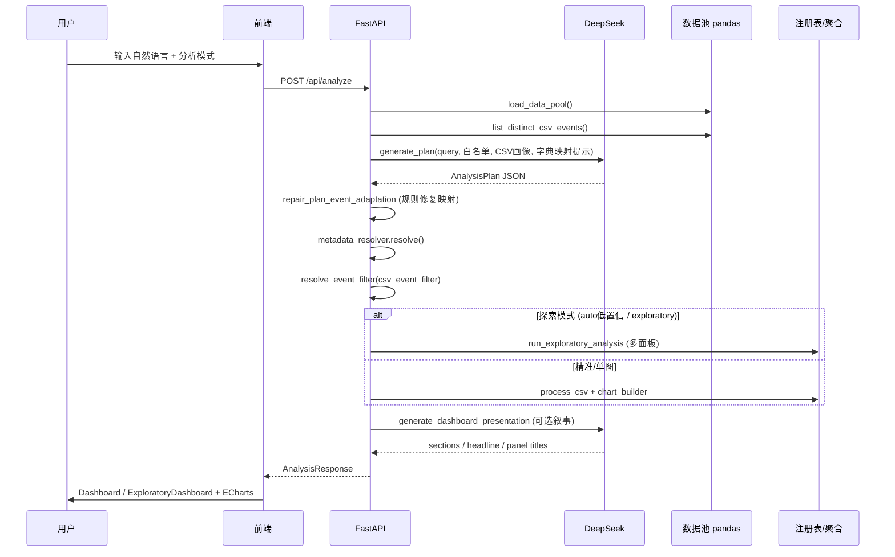
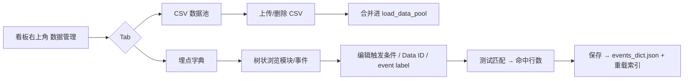

# AI 座舱埋点看板系统 — 产品与技术规格 v4.0

> 版本：v4.0  
> 日期：2026-06-02  
> 状态：**可交付**（集成测试 + 前端生产构建 + ECS 部署）  
> 仓库：https://github.com/mjnn/AI_Dashboard  
> 线上入口：http://47.116.180.173/tools/ai-dashboard/

---

## 1. 产品概述

### 1.1 目标

面向座舱埋点运营/产品/数据同学，提供**自然语言驱动的分析看板**：用户描述分析问题 → 系统理解意图 → 自动选分析类型与图表 → 基于数据池 CSV 聚合 → 渲染可视化与运营叙事。

### 1.2 核心价值

| 能力 | 说明 |
|------|------|
| 零 SQL | 自然语言提问，无需手写查询 |
| 数据池即插即用 | 前端上传或运维放入 CSV，目录内多文件自动合并 |
| 智能 + 精准 + 探索 | 三种分析模式，兼顾效率与全面性 |
| 字典增强 + 边测边改 | 1312 事件埋点字典；数据管理页可树状浏览、编辑口径、测试 CSV 匹配 |
| 字典↔CSV 双轨映射 | LLM 输出 `matched_event`（字典名）与 `csv_event_filter`（实际过滤值） |
| 运营叙事 | LLM 对图表面板分区、起标题、写洞察 |
| 可视化主题 | 5 套预设色板 + 自定义，分类图表按色板逐类区分 |

### 1.3 v4.0 相对 v3.0 新增

| 变更 | 说明 |
|------|------|
| 数据管理页 | CSV 上传/删除 + 埋点字典树状编辑，合并为独立页面 |
| 字典 API | 树/详情/保存/测试匹配四套接口 |
| 图表配色 | ChartThemePicker + localStorage 持久化 |
| 事件映射 | LLM 必填 `csv_event_filter`；`event_mapping.repair_plan_event_adaptation` 规则兜底 |
| 前端部署 | Nginx subpath `/tools/ai-dashboard/`，`.env.production` 固定 VITE_BASE |
| ECS 交付 | Docker + compose @8011，ACR 镜像推送，CSV 宿主机 volume |

### 1.4 v4.1 增量（2026-06-02）

| 变更 | 说明 |
|------|------|
| **图表口径块** | `panel_caliber.py` + `PanelCaliberBlock`：图表构成 / 统计口径 / 分组规则 / 指标计算，21 类型全覆盖 |
| **Agent 规划** | `analysis_agent.py`：意图→故事→可视化→可行性校验；`agent_payload_repair` 仅修 Schema |
| **路由记忆** | `analysis_route_memory.py` 缓存相似 query 的分析路由（本地 JSON，不进 Git） |
| **留存分桶** | `usage_retention` 固定 11 桶：使用1次…使用10次、使用10次以上（空桶补 0） |
| **多事件分析** | 漏斗 / event_comparison 增强；`event_display` 本地化事件名 |
| **测试收敛** | `test_analysis_coverage` / `test_analysis_performance` / `plan_factory` 场景库 |
| **i18n** | 中/英界面；移除 de  locale |

---

## 2. 系统架构

### 2.1 总体架构

```
┌──────────────────────────────────────────────────────────────────────────┐
│  浏览器 (React 18 + Vite 5 + Tailwind + ECharts)                          │
│  ┌─────────────┐  ┌──────────────────┐  ┌─────────────────────────────┐  │
│  │ 看板主页     │  │ 数据管理页        │  │ 图表主题 (ChartThemeContext) │  │
│  │ InputPanel  │  │ CSV 数据池        │  │ 5 预设 + 自定义色板          │  │
│  │ Dashboard   │  │ 埋点字典树+编辑器  │  └─────────────────────────────┘  │
│  └──────┬──────┘  └────────┬─────────┘                                    │
└─────────┼──────────────────┼──────────────────────────────────────────────┘
          │ REST /api/*      │
┌─────────▼──────────────────▼──────────────────────────────────────────────┐
│  FastAPI (main.py) — 单进程，lifespan 加载字典索引                            │
│  ├─ 数据层    load_data_pool / DictPreprocessor / dict_storage             │
│  ├─ LLM 层    llm_planner / recommendation_service / dashboard_narrator    │
│  ├─ 解析层    field_resolver / event_mapping / metadata_resolver           │
│  ├─ 分析层    csv_processor / exploratory_analyzer / chart_builder / panel_caliber │
│  └─ 管理层    csv_storage / dict_tester                                    │
└─────────┬──────────────────┬───────────────────────┬────────────────────────┘
          │                  │                       │
          ▼                  ▼                       ▼
  events_dict.json    backend/data/*.csv      DeepSeek API
  (1312 事件)         (数据池，可前端上传)     deepseek-v4-flash
```

### 2.2 部署架构（ECS）

```
用户 → Nginx :80 /tools/ai-dashboard/
         └─ proxy_pass → 127.0.0.1:8011 (ai-dashboard 容器 :8000)
              ├─ /api/*     FastAPI
              └─ /*         SPA static (frontend/dist)
镜像: crpi-02k3y8iudey5q0vb.cn-shanghai.personal.cr.aliyuncs.com/mirror_ns/ai-dashboard:latest
配置: /srv/apps/ai-dashboard/{compose.yaml, .env.runtime}
```

| 变量 | 说明 |
|------|------|
| `HOST_PORT` | 8011 |
| `CONTAINER_PORT` | 8000 |
| `CSV_DATA_PATH` | ./data（容器内持久化需挂载 volume，当前 compose 使用镜像内 data） |
| `DEEPSEEK_API_KEY` | 仅存 ECS `.env.runtime`，不进 Git |
| `FRONTEND_DIST` | /app/frontend/dist |

前端构建（subpath 必配）：

```dotenv
# frontend/.env.production
VITE_BASE=/tools/ai-dashboard/
VITE_API_BASE=/tools/ai-dashboard
```

---

## 3. 核心工作流

### 3.1 主分析流程（POST /api/analyze）



**步骤说明：**

1. **加载事实数据**：合并 `CSV_DATA_PATH` 下全部 `.csv`；提取 event 列去重值、列名列表。
2. **LLM 计划生成**（`llm_planner.generate_plan`）：
   - System prompt 注入：事件白名单、21 种 analysis_type catalog、12 种 chart catalog、CSV event 列表、字典↔CSV 映射提示。
   - 要求输出结构化 JSON：`analysis_type`, `matched_event`, **`csv_event_filter`**, `metrics`, `visualization`, `time_range` 等。
   - `response_format: json_object`，temperature=0.1。
3. **计划修复**（`event_mapping.repair_plan_event_adaptation`）：LLM 漏填或填错 `csv_event_filter` 时，用规则从字典反查 CSV label。
4. **元数据解析**（`metadata_resolver` + `field_resolver`）：CSV 为事实来源；字典提供别名与属性语义；无法映射时使用 virtual event，分析不中断。
5. **事件过滤**（`resolve_event_filter`）：最终用 `csv_event_filter` 在 pandas 中过滤行。
6. **模式分发**：
   - `precise`：始终单图；
   - `exploratory`：批量可行分析；
   - `auto`：`intent_confidence=low` 或用户笼统提问 → 探索，否则单图。
7. **聚合与出图**（`csv_processor` + `chart_builder` + `panel_caliber`）：按注册表确定性聚合；`ChartConfig.caliber_detail` 含图表构成与指标说明。
8. **看板叙事**（`dashboard_narrator`，LLM 第二次调用）：为多面板生成 headline、分区、副标题；失败则规则兜底。

### 3.2 LLM 参与点总览

| 阶段 | 模块 | LLM 输入 | LLM 输出 | 失败策略 |
|------|------|----------|----------|----------|
| 智能推荐 | `recommendation_service` | 数据画像 + 分析 catalog | 4–6 条推荐问题 | 规则 fallback |
| 分析计划 | `llm_planner` / `analysis_agent` | 用户 query + 白名单 + CSV/字典提示 | `AnalysisPlan` JSON | 502 + 校验错误 |
| 映射修复 | `event_mapping` | （规则，非 LLM） | 补全 `csv_event_filter` | — |
| 看板叙事 | `dashboard_narrator` | 各 panel 摘要 + plan | presentation JSON | 规则 fallback |

**LLM 不做的事：**

- 不直接访问 CSV 原始行（仅通过后端摘要：列名、event 列表、行数、日期范围等）；
- 不执行 pandas 聚合（由 `csv_processor` 按注册表实现）；
- 不生成任意 Python/SQL（formula 指标仅允许白名单字符）。

### 3.3 字典 ↔ CSV 映射机制

字典 event 名（中文 canonical）与 CSV `event` 列取值（英文 code，如 `carlog_entry`）格式往往不一致。

```
用户问题: "分析 carlog"
    ↓ LLM
matched_event: "Carlog_进入"          ← 字典展示名、口径说明
csv_event_filter: ["carlog_entry", "carlog_exit", ...]  ← 实际过滤
    ↓ resolve_event_filter
pandas: df[event_col].isin(csv_event_filter)
```

**映射来源优先级：**

1. LLM 显式输出的 `csv_event_filter`（经 `sanitize_csv_event_filter` 校验存在于数据池）；
2. `repair_plan_event_adaptation` 从字典属性 `eventname.label` 反查；
3. `field_resolver._csv_labels_for_event` 从字典 aliases 匹配；
4. 模块级 query 时 `event_scope.infer_related_csv_events` 扩展为模块相关全部 CSV event。

**数据管理页「边测边改」：**

- `POST /api/dictionary/test-event`：用草稿 label 统计命中行数、样例、相近 CSV 建议；
- `PUT /api/dictionary/events/{name}`：保存后重载 `events_index` 并清除推荐缓存。

### 3.4 智能推荐流程（GET /api/recommendations）

1. `build_data_profile()` 读取数据池：行数、日期跨度、Top event、VIN 数、可行 analysis_type。
2. LLM 根据画像 + catalog 生成 4–6 条可点击问题（含 `analysis_mode`）。
3. 缓存键 = 数据池文件 mtime 组合；CSV/字典变更时失效。

### 3.5 数据管理工作流



---

## 4. 数据层

### 4.1 数据池

| 配置项 | 说明 |
|--------|------|
| `CSV_DATA_PATH` | CSV 目录，默认 `backend/data` |
| 加载 | `load_data_pool()` concat 目录下全部 `.csv` |
| 上传 | `POST /api/csv-files/upload`，最大 200MB，校验 pandas 可读 |
| 空目录 | `/api/analyze` 与 `/api/recommendations` 返回 422 |

### 4.2 事件字典

| 项 | 说明 |
|----|------|
| 文件 | `backend/data/events_dict.json` |
| 结构 | `功能列表[] → 事件列表[] → 属性列表[]` |
| 索引 | 启动时 `DictPreprocessor` → `events`, `alias_index`, `modules` |
| 别名 | 属性 `eventname.label` 优先绑定 CSV code；模块名等泛化 alias 用 setdefault |

### 4.3 字段解析（field_resolver.py）

```
精确 canonical / alias
  → CSV event 值反查（上下文消歧）
  → 字典模糊匹配
  → CSV 虚拟 event（unmapped=true，分析继续）
```

---

## 5. 分析能力

### 5.1 分析类型（21 种）

定义于 `backend/services/analysis_registry.py`：time_series, dimension_breakdown, top_n_ranking, usage_retention, usage_distribution, active_days_distribution, penetration, cross_dimension, summary_kpi, period_pattern, new_vs_returning, repeat_rate, cohort_retention, funnel, event_comparison, active_users, growth_rate, stickiness, percentile_stats, heatmap_time, first_touch_trend

### 5.2 图表类型（12 种）

line, area, multi_line, dual_axis, bar, horizontal_bar, stacked_bar, pie, table, heatmap, gauge, funnel_chart

分类图表（单系列 bar/pie/funnel）按 `ChartThemeContext` 色板逐类着色。

### 5.3 分析模式

| 模式 | 值 | 行为 |
|------|-----|------|
| 智能 | auto | 意图明确 → 单图；模糊 → 探索 |
| 精准 | precise | 始终 LLM 单一计划 |
| 探索 | exploratory | 批量可行分析（多面板） |

---

## 6. API 规格

### 6.1 端点一览

| 方法 | 路径 | 说明 |
|------|------|------|
| GET | `/api/health` | 服务、事件数、数据池状态 |
| GET | `/api/events` | 模块分组事件列表 |
| GET | `/api/recommendations` | LLM 分析推荐 |
| GET | `/api/analysis-types` | 分析/图表注册表 |
| POST | `/api/analyze` | **主分析** |
| GET | `/api/csv-files` | 数据池文件列表 |
| POST | `/api/csv-files/upload` | 上传 CSV |
| DELETE | `/api/csv-files/{filename}` | 删除 CSV |
| GET | `/api/dictionary` | 字典树 |
| GET | `/api/dictionary/events/{name}` | 事件详情 |
| PUT | `/api/dictionary/events/{name}` | 保存事件 |
| POST | `/api/dictionary/test-event` | 测试 CSV 匹配 |

### 6.2 POST /api/analyze 请求体

```json
{
  "query": "carlog最近7天每日趋势",
  "analysis_mode": "auto"
}
```

响应 `mode`: `single` | `exploratory`；含 `plan`, `execution`, `chart_config`, 可选 `presentation`, `panels[]`。

---

## 7. 前端规格

### 7.1 页面结构

| 页面/组件 | 职责 |
|-----------|------|
| **App** | 看板主页 vs 数据管理页切换 |
| **InputPanel** | 自然语言输入、三档模式、LLM 推荐 |
| **Dashboard** | 单图 + presentation |
| **ExploratoryDashboard** | 多面板分区布局 |
| **PanelCaliberBlock** | 图表构成 / 口径 / 分组规则 / 指标计算 |
| **AnalysisPanelCard** | 单面板卡片 + 口径块 |
| **DataManagementPage** | CSV + 字典双 Tab |
| **DictionaryPanel** | 树状字典 + 搜索 |
| **DictionaryEventEditor** | 编辑 + 测试匹配 + 保存 |
| **ChartThemePicker** | 图表配色 |

### 7.2 构建与代理

- 开发：Vite proxy `/api` → `127.0.0.1:8000`
- 生产：`VITE_BASE` 必须与 Nginx location 一致
- 请求超时：120s

---

## 8. 测试与验收

```bash
cd backend && python -m pytest tests/test_integration.py::TestApiNoLlm -q
cd backend && python -m pytest tests/test_chart_builder_caliber.py -q
cd backend && python -m pytest tests/test_analysis_coverage.py -k "not llm" -q
cd frontend && npm run build
```

**TestApiNoLlm 覆盖（10+）**：health, events, analysis-types, csv CRUD, dictionary tree/detail/test

**LLM 用例**（需 `DEEPSEEK_API_KEY`）：recommendations, carlog auto/precise/exploratory, 留存分桶

**关键验收：**

| 场景 | 预期 |
|------|------|
| `分析carlog` | matched=Carlog_进入，filtered 大量 carlog 相关行 |
| 数据管理 → 字典 → Carlog_进入 → 测试 | carlog_entry 命中 >0 |
| 上传 CSV | 数据池 total+1，推荐刷新 |
| ECS index.html | asset 路径含 `/tools/ai-dashboard/assets/` |

---

## 9. 关键文件索引

| 文件 | 职责 |
|------|------|
| `backend/main.py` | 路由、lifespan、分析编排 |
| `backend/services/llm_planner.py` | **LLM 分析计划** |
| `backend/services/event_mapping.py` | 字典↔CSV 映射与计划修复 |
| `backend/services/field_resolver.py` | 事件/字段解析 |
| `backend/services/csv_processor.py` | 数据池与聚合（留存分桶 1–10+） |
| `backend/services/panel_caliber.py` | **图表口径与构成说明** |
| `backend/services/analysis_agent.py` | Agent 多轮分析规划 |
| `backend/services/analysis_route_memory.py` | 分析路由缓存 |
| `backend/services/agent_payload_repair.py` | Agent JSON schema 修复 |
| `backend/services/data_feasibility.py` | 可视化提案可行性校验 |
| `frontend/src/components/PanelCaliberBlock.tsx` | 口径展开 UI |
| `backend/services/exploratory_analyzer.py` | 探索模式 |
| `backend/services/dashboard_narrator.py` | **LLM 看板叙事** |
| `backend/services/recommendation_service.py` | **LLM 推荐** |
| `backend/services/dict_storage.py` | 字典读写/重载 |
| `backend/services/dict_tester.py` | 字典 CSV 匹配测试 |
| `backend/services/csv_storage.py` | CSV 上传管理 |
| `frontend/src/components/DataManagementPage.tsx` | 数据管理入口 |
| `scripts/deploy-to-ecs.sh` | ECS 构建部署脚本 |

---

## 10. 已知限制

| 项 | 说明 |
|----|------|
| 探索模式耗时 | 多面板 + LLM 叙事，约 30–70s |
| 字典体积 | events_dict.json 较大，树接口返回摘要，详情按需加载 |
| 字典持久化 | ECS 容器内修改需 volume 挂载才能跨部署保留 |
| 大数据 | 10 万行可跑；百万级需 OLAP |
| bundle 体积 | ECharts >500KB，可后续 code-split |

---

## 11. 交付清单（v4.1）

- [x] 自然语言分析主流程 + 字典↔CSV 双轨映射
- [x] 数据池 + 前端 CSV 上传 + ECS CSV volume
- [x] 数据管理页 + 字典树状编辑 + 边测边改
- [x] 图表配色主题 + i18n（中/英）
- [x] LLM 推荐 + 计划 + 看板叙事
- [x] Agent 规划 + 可行性校验 + 路由记忆
- [x] **PanelCaliberBlock 全类型口径说明**
- [x] **usage_retention 11 桶（1–10 + 10次以上）**
- [x] 分析覆盖/性能测试收敛脚本
- [x] ECS Docker 部署 + Nginx subpath
- [x] GitHub 同步
- [x] 规格文档 v4.0 / 进度 PROGRESS.md

---

*v4.1 在 v4.0 基础上增量；以仓库代码、测试与线上部署为准。*
